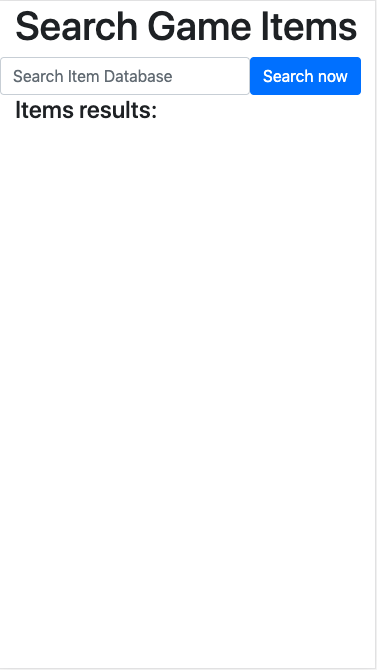
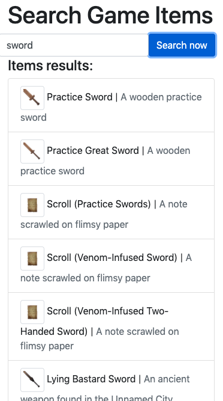
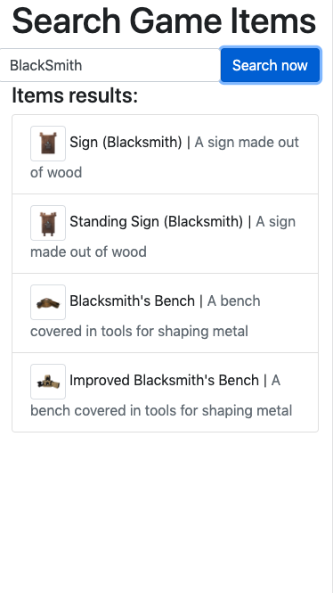

# Game Items Search:

This is a simple application for the game items search api. 
The major of the application is to retrieve the information from data.json. 

## Package usage :

* bootstrap

* jquery

* lodash

| 

 |
